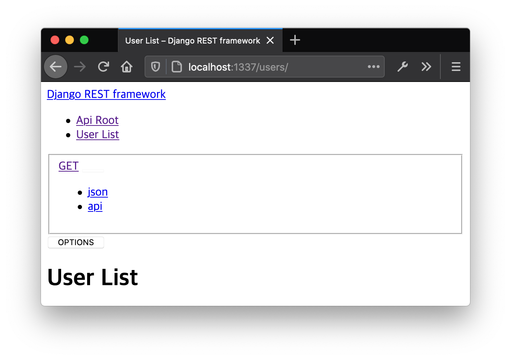

###### 최종 수정일 : 2020-10-15

## 프로젝트 소개

**시각장애인을 위한 버스 이용 보조 서비스**
* 내려야할 정류장을 탑승 전에 미리 예약하는 기능
* 타야할 버스의 번호를 쉽게 입력할 수 있는 기능

## 프로젝트 구성
* [Server](https://github.com/yangjae33/tajo_backend)
* [App](https://github.com/seungyeonchoi/tajo_frontend)
* [Device](https://github.com/yyoonsahng/2020ESWContest_free_1081/wiki)


## 개발환경

* Ubuntu 16.04
* Mac OS X 10.15.3

## 구성 요소

* Django 3.0.8
* nginx 1.19.0
* gunicorn 20.0.4

## 설치 및 사용법

**1. Clone Repository**

```
git clone https://github.com/yangjae33/tajo_backend.git
```

**2. docker-compose 설치**

[Docker&Docker-compose 설치 참고](https://docs.docker.com/compose/install/)

**3. 설치 완료 후 명령어 입력**

```
docker-compose up --build
```

**4. 브라우저 주소창에 localhost:1337 입력으로 접속 확인**



## API 목록

* [Wiki](https://github.com/yangjae33/tajo_backend/wiki)

## DB

* NCloud - Postgresql

## Author

* [양재혁](https://github.com/yangjae33)

## TEAM 함께타조

* [김윤상](https://github.com/yyoonsahng)
* [양재혁](https://github.com/yangjae33)
* [전효진](https://github.com/gywlssww)
* [최승연](https://github.com/seungyeonchoi)
